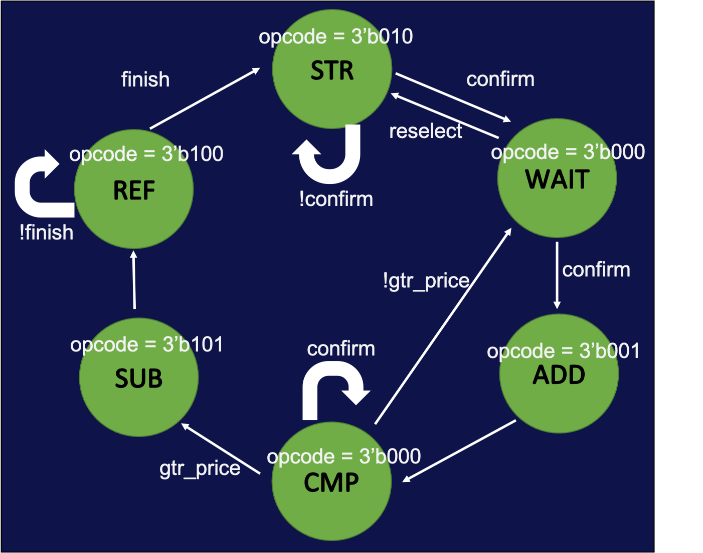
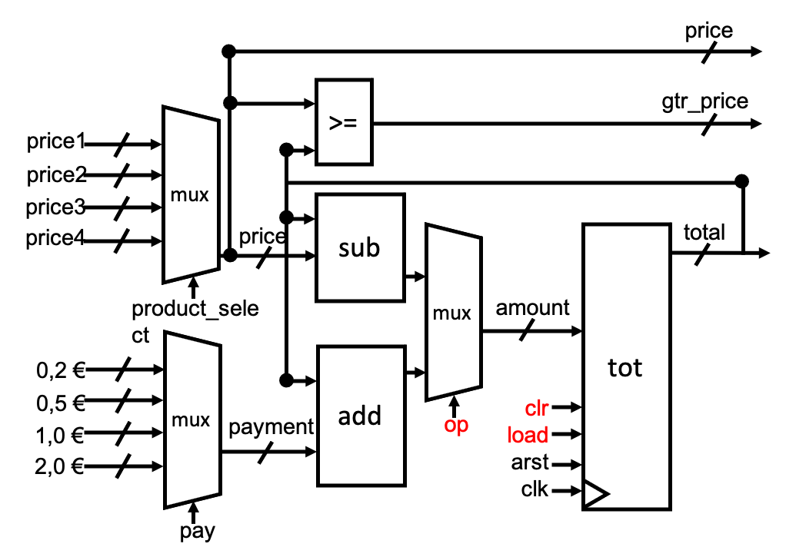
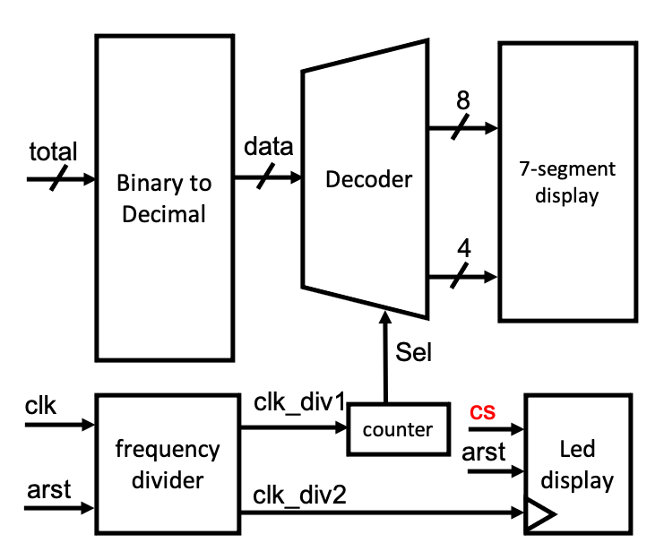

# Approach

## Vending machine 1 - Control Unit

The control system is the most important part of this topic. The main system is responsible for the selection of goods and the decision-making of operations. It also includes an HDMI video generator, which can encode and output the part to be displayed, and then decode it. Then there is the part of the interface that can be seen on the screen.

Figure 3.1 shows the state state diagram of the control system.

<!--  -->

## Vending machine 2 - Operational Unit

The operation circuit diagram is in Figure 3.2
1. The **total**, **payment**, and **amount** signal consists of multiplexers, adder, subtractor and register.
2. The red input is the **opcode(op,clr,load)** controlled by the Control Unit.
3. Comparator produces output signal **gtr_price(greater than price)**

<!--  -->

## BCD/LED Interface

The BCD/LED  interface uses the control signal from the Control Unit and the data from the operational Unit to generate the Binary-Coded Decimal on Seven-segment display and LED on FPGA Board.

The BCD Interface circuit diagram is in Figure 3.3

1. Transmit the binary data(total, price) to BCD converter. 
2. Decode the Decimal data and show on the 7-segment display.
3. Use frequency divider and a counter to control the 7-segment display.
4. Generate the led signal by a shift register to show different state.

<!--  -->

## HDMI Interface

The HDMI interface uses the control signal from the Control Unit to determine the output image encoding.

HDMI includes 3 TMDS data channels and 1 TMDS clock channel.
In each TMDS clock cycle, a 10-bit character information is sent on the TMDS data channel.

In each TMDS clock cycle, the encoder encodes 2-bit control data, 4-bit report data or 8-bit video data into 10-bit data using different encoding methods; the first 8-bit data is obtained by UI moduel after operation to obtain RGB signal, the 9th bit indicates the operation mode, and the 10th bit is used to correspond to DC-balanced 

>DC-balanced, which means to ensure that the DC offset in the channel is zero during the encoding process, and the level conversion realizes the matching between different logical interfaces

It contains two modules:
- UI Generator
- TDMS Encoder

Following step:
1. Generate the 24 bit RGB signals by **UI Generator**, which shows the User Interface.
2. Send 8-bit parallel RGB data to **TMDS Encoder**.
3. Convert 8-bit data to 10-bit data.
4. The converted data is transmitted by differential drive trough HDMI and display on screen.